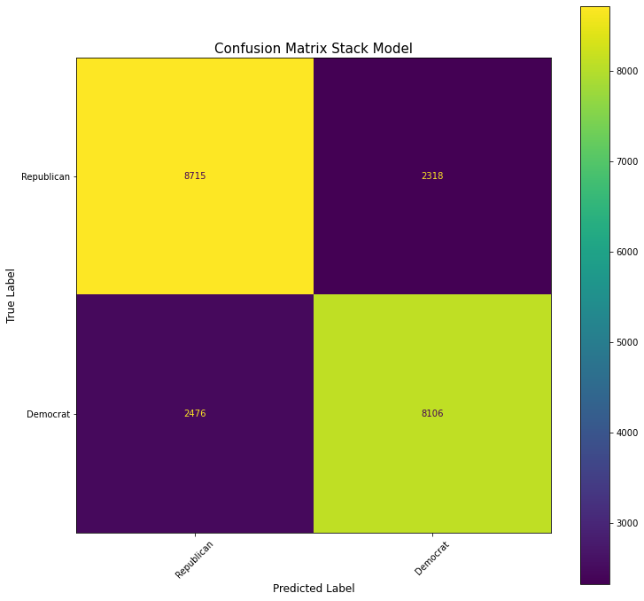
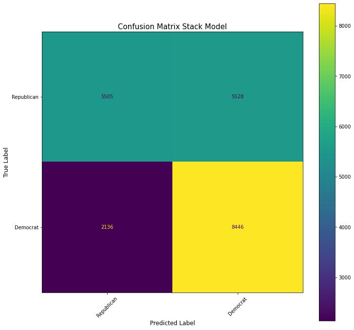
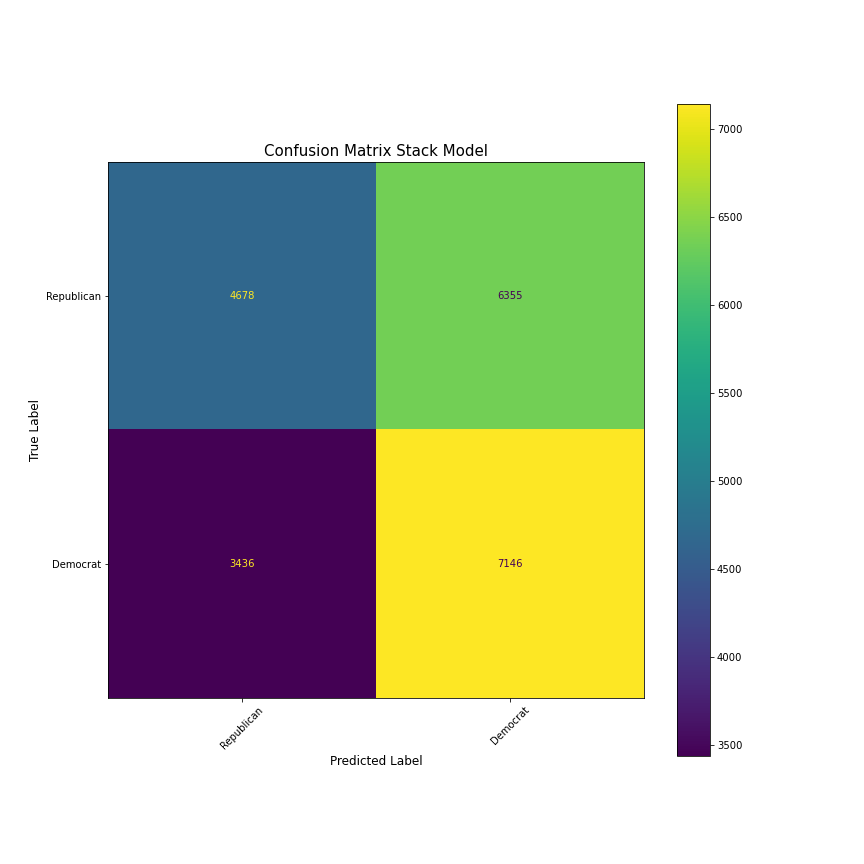

# Capstone-Project

## Project Scope

Natural Language Processing (NLP) has been a great breakthrough in the way in which we can train computers to understand the complex nature of human speech patterns. Human speech is such a complex system that most humans cannot even explain why they use language in certain ways. This is why the promise of NLP is so exciting: can machines be trained to understand language more accurately than the human mind. The answer up to this point has been a little murky. Machines trained on neural linguistic patterns can pick up those patterns of speech even when left unsupervised by human beings (unsupervised learning). That unsupervised learning can then be harnessed into supervised models for the purpose of prediction and ... . 

The question I wanted to explore in this project was whether topic modeling can add a needed dimension to current NLP methods (i.e. count vectorizing, TF-IDF, Word2Vec, etc.) in classification problems. Whereas NLP tries to take the context of a document and use those patterns to understand individual words, topic modeling takes the corpus of text and tries derive patterns in those words to look at the global themes that could exist. The main question explored is whether the results of unsupervised topic modeling are better at predicting a classification problem than purely vectorizing words? 
 
Specifically the focus for this project was to take a set of tweets from US congressional members to see if there are any discernible differences in language patterns in the texts that can help determine a difference between Democrats and Republicans, using vectorization and topic modeling.

## Data Gathering:

I sincerely thank the work done by Kamal Choubi to collect the tweets that I used for this project.  In his article he explains the process he used to collect the data:

"To start we need to figure out what Twitter accounts are Democrat or Republicans. TweetCongress.org, a directory of members of Congress on Twitter, lists 101 Republicans on the site and just 57 Democrats. Each party is mostly held up by a few Twitter superstars (like Democratic Sen. Claire McCaskill and Republican Sen. John McCain), but congressional Republicans overall have more followers and tweet more often.
Another option is to look directly at the @TheDemocrats and @HouseGOP member lists on Twitter. After exploring the lists, you can see that we can pull all of the fullname and username class elements. We will also save the URL of the avatar image and keep it for later.
I will use Beautiful Soup to extract the handles. It is a Python library for parsing HTML and XML documents. When the HTML or XML document is poorly formed (for example if it lacks closing tags), Beautiful Soup offers a heuristic-based approach in order to reconstruct the syntax tree without generating errors.
Then , I need to create a dataset containing the tweets of these members related to the 2018 U.S. Congressional Election. I collected the tweets between January 22, 2018 and January 3, 2019 from the Twitter API using ."

## Methods

In this section I will explaining my methods in both the EDA process and the modeling process.

### EDA:

The first step in the EDA process was to tokenize the tweets, meaning that I split the tweets into individual words, then lowercased all of the words, stripped out punctuation's and accents, and removed all of the most common English words that would provide context to the tweet. These are called 'stopwords' and include words like "the", "and", "of", etc. I then created a new feature in the dataframe that included all of the these new word tokens.

Next, I wanted to find what were the top 20 words used in the all of the corpus. For this process and for the next several visualizations, I used a software called . Within this software package there are built in visualization tools for top words, word clouds, and PCA analysis, among many others. I used all three specified visualizations in this project.

The last step of the EDA process was the topic modeling. For topic modeling I used a process know as Latent Dirichlet Allocation(LDA), which is a generative statistical model that allows sets of observations to be explained by unobserved groups that can explain why some parts of the data are similar. 

For this analysis, I experimented with setting the machine to look for 10 topics, 20 topics, and then 30 topics. 20 seemed to be the sweet spot, creating interesting topics while keeping separation between the topics. In order to visualize these topics I used the psLDAvis library, which created some very interesting visuals. In order to create the visuals, psLDAvis takes the topics found within n-dimensional space and reduce that data down to 2 dimension. There is inevitably going to be data lost in this process, so psLDAvis includes 3 different types of dimensionality reduction techniques. A good explanation of the differences in the 3 different techniques is found . It is explained as: 
    
    "Simply put: text data, when transformed into numeric tabular data, usually is high-dimensional. On the other hand, visualizations on a screen is two-dimensional (2D). Thus, a method of dimension reduction is required to bring the number of dimensions down to 2. MDS stands for multidimensional scaling. The possible values of that argument are:

    mmds (Metric Multidimensional Scaling),
    tsne (t-distributed Stochastic Neighbor Embedding), and
    pcoa (Principal Coordinate Analysis),

    All of them are dimension reduction methods."
    
Lastly, I wanted to take the results of the topic modeling, create a dataframe from those results, and concatenate it with the original dataframe to do analysis on which topics were most popular with each party and each individual member of congress.  

The code and visualizations can be found in this . 

### Modeling

For the modeling process I wanted to create one model that I could use use on only the tokens, and then with the topics from the LDA process. I also ended up trying the same stacked model with tokens and bi-grams. In order to build that model I set up a gridsearch on three different models: a logistic regression, a random forest, and a gradient booster. I took the results from the grid search of each model individually as parameters to use on each model within the stack. The results of the stack model are as follows:

**Stacked model on only vectorized tokens** 

**Stacked model on bi-grams**

**Stacked model on LDA topic modeling** 

The best result was on the tokens only which had a 78% accuracy.

The code for the models can be found in this 

## Summary

As can be seen in the confusion matrices above, the model that fit only on the tokens was much more accurate than the model with the bi-grams, and even more so than with the topic modeling. This was very surprising to me as I thought the topic modeling would add a dimension to the vectorized tokens that would allow for a more accurate prediction. In all, I was happy with the best model being 78% accurate. I was comfortable with this outcome because the tweets came from members of congress and were therefore toned down in rhetoric. This meant that there far fewer distinctions in the language used than would likely be seen in the general public. I believe that if this same method was attempted on tweets from public citizens, it would likely by more accurate because the differences in tone and therefore language patterns would be higher.  

## Conclusion/Future Research

Going forward, I would like to take in the words of David Blei, one of the key architects of the LDA process used in machine learning. He said, "Unsupervised LDA has previously been used to construct features for classification. The hope was that LDA topics would turn out to be useful for categorization, since they act to reduce data dimension (Blei et al., 2003; Fei-Fei and Perona, 2005; Quelhas et al., 2005). However, when the goal is prediction, fitting unsupervised topics may not be a good choice." Through this project I have come to the same conclusion. In the same  in which Blei made the comment, he promotes a concept of supervised LDA. From my own research, a supervised process would included being able to seed an LDA process with pre-established topics and words to look for that fit those topics. Then machine would learn on that pre-supplied data and be able to tell if those topics exist within the corpus being studied. For me, a supervised LDA is the way forward and will be something that I will amend to this project at a later time.

